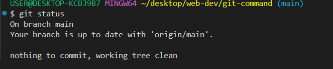

# git-command
this ripos contains the command for working with git


  `'git init'`  - this command is use to initialise a git repository
  ```bash
  git init
  ```

  `git status` this command is used to push th code from the local repository
  ```sh
  git status
  ```
  